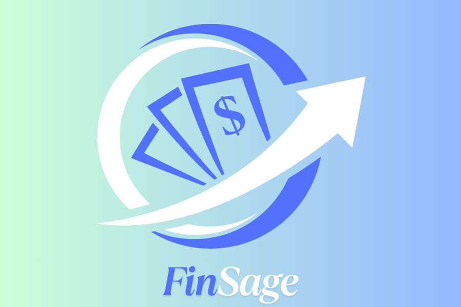

<div align="center">

# FinSage - AI Powered Financial Literacy & Portfolio Management



[](https://reactjs.org/)
[](https://www.typescriptlang.org/)
[](https://vitejs.dev/)
[](https://tailwindcss.com/)
[](https://tanstack.com/query)
[](https://reactrouter.com/)

[](https://recharts.org/)
[](https://www.radix-ui.com/)
[](https://axios-http.com/)
[](https://finnhub.io/)
[](https://zod.dev/)
[](https://react-hook-form.com/)

[](https://opensource.org/licenses/MIT)
[](https://github.com/jishanahmed-shaikh/finsage-app)
[](https://github.com/jishanahmed-shaikh/finsage-app)

**🚀 Your AI-Powered Investment Portfolio Assistant**

*Democratizing financial intelligence through cutting-edge AI technology and intuitive design*

</div>

## 📋 Table of Contents

- [🎯 Inspiration](#-inspiration)
- [✨ What it does](#-what-it-does)
- [🛠️ How we built it](#️-how-we-built-it)
- [🚧 Challenges we ran into](#-challenges-we-ran-into)
- [🏆 Accomplishments that we're proud of](#-accomplishments-that-were-proud-of)
- [📚 What we learned](#-what-we-learned)
- [🔮 What's next for FinSage](#-whats-next-for-finsage)
- [⚡ Quick Start](#-quick-start)
- [🚀 Deployment](#-deployment)
- [👥 Team](#-team)
- [🙏 Acknowledgments](#-acknowledgments)
- [📄 License](#-license)

---

## 🎯 Inspiration

FinSage was born from a recognition of the significant challenges many individuals face when managing their investments and financial decisions. We observed that:

1. Financial literacy remains inaccessible to many, creating barriers to effective investing
2. Existing portfolio management tools are often complex and intimidating for beginners
3. High-quality financial advice traditionally requires expensive advisors or extensive self-education

We envisioned a platform that could democratize financial intelligence by combining cutting-edge AI technology with intuitive design, making sophisticated portfolio management accessible to everyone - from beginners to seasoned investors.

## ✨ What it does

FinSage is a comprehensive fin-tech Oriented platform that promotes Financial Literacy, track investments, analyze stocks, and receive personalized AI guidance.
Key features include:

### Portfolio Dashboard

- Complete overview of asset allocation and diversification
- Performance tracking with interactive metrics and visualizations
- Risk assessment and portfolio health indicators
- 

### Stock Performance Analytics

- Real-time data visualization with interactive charts
- Technical indicators and fundamental analysis
- Comparison tools for evaluating different investment options
- 

### AI Financial Assistant

- Natural language interface for financial queries
- Personalized investment advice based on user's portfolio
- Explanations of complex financial concepts in simple language
- Market insights and trend analysis
- 

### Financial Learning Hub

- Educational resources tailored to knowledge level
- Interactive tutorials and skill-building modules
- Achievement tracking to gamify the learning experience
- 


### Returns Calculator

- Projection tools for potential investment returns
- Tax impact forecasting for investment decisions
- Retirement planning and goal-setting features

## 🛠️ How we built it

FinSage leverages a modern technology stack designed for performance, scalability, and user experience:

### Frontend Architecture

- **React & TypeScript**: Provides a robust foundation for our interactive UI
- **Vite**: Enables extremely fast build times and development experience
- **Tailwind CSS**: Implements a responsive design system that works across device sizes
- **shadcn/ui**: Ensures consistent, accessible UI components throughout the application
- **React Query**
- 


### Backend Architecture

- **Under Construction**

### Data Visualization

- **Recharts**: Creates interactive, responsive financial charts and graphs
- Optimized visualizations for both desktop and mobile viewing
- 

### State Management and Data Fetching

- **React Query**: Implements efficient data fetching, caching, and synchronization
- Provides real-time updates while minimizing network requests

### User Experience Design

- Conducted extensive user research with investors of varying experience levels
- Implemented accessibility features following WCAG guidelines
- Created intuitive navigation and information architecture

## 🚧 Challenges we ran into

Building FinSage presented several significant challenges:

1. **Balancing Complexity and Accessibility**: Creating a platform that's powerful enough for experienced investors but accessible to beginners required careful UI/UX decisions and multiple iterations.
2. **Data Visualization Optimization**: Rendering complex financial charts while maintaining performance on mobile devices demanded sophisticated optimization strategies.
3. **Financial Education Content**: Developing educational content that adapts to different knowledge levels and learning styles required collaboration with financial experts.
4. **Responsive Design Implementation**: Ensuring a seamless experience across all device sizes presented layout and interaction challenges, especially for data-heavy visualizations.
5. **User Authentication and Security**: Implementing robust security measures while maintaining a smooth user experience required careful architecture decisions.

## 🏆 Accomplishments that we're proud of

1. **Intuitive AI Interface**: Our conversational AI goes beyond simple chatbot functionality to provide deeply personalized financial guidance that adapts to user needs.
2. **Responsive Dashboard**: Created a fully responsive financial dashboard that maintains functionality across all device sizes without compromising on features.
3. **Educational Integration**: Successfully integrated learning resources within the context of portfolio management, helping users improve their knowledge while making real decisions.
4. **Performance Optimization**: Achieved excellent performance metrics despite the data-intensive nature of financial applications, with interactive charts that remain responsive even on mobile devices.
5. **Accessibility**: Built the platform with a strong focus on accessibility, ensuring that financial tools are available to everyone regardless of ability.

## 📚 What we learned

Developing FinSage provided valuable insights and learning opportunities:

1. **Financial Data Complexity**: Working with financial data revealed the challenges of normalizing and presenting complex information in an understandable way.
2. **User-Centered Design Process**: We refined our approach to user testing and feedback integration, developing more effective methods for translating user needs into features.
3. **React Performance Optimization**: We gained deeper expertise in optimizing React applications for performance, especially when dealing with data-heavy visualizations.
4. **Tailwind CSS Implementation**: We developed more sophisticated strategies for maintaining design consistency while leveraging Tailwind's utility-first approach.
5. **Collaborative Development Workflows**: We improved our processes for collaborative development, finding better ways to integrate design and development workflows.

## 🔮 What's next for FinSage

Our roadmap for FinSage includes several exciting features and improvements:

1. **Advanced Portfolio Optimization**: Implementing sophisticated algorithms to suggest optimal asset allocation based on user risk tolerance, time horizon, and financial goals.
2. **Expanded Asset Classes**: Adding support for alternative investments, cryptocurrencies, and other emerging asset classes to provide more comprehensive portfolio management.
3. **Social Learning Features**: Introducing community-based learning opportunities where users can share insights and strategies in a moderated environment.
4. **Automated Tax Optimization**: Developing intelligent tax-loss harvesting recommendations and tax impact forecasting for investment decisions.
5. **Enhanced Mobile Experience**: Continuing to refine our mobile interface to ensure FinSage is fully functional and intuitive on all devices.
6. **API Integrations**: Building connections to major brokerages and financial institutions for seamless data synchronization.
7. **Personalized Learning Paths**: Creating individualized educational journeys based on user knowledge level, interests, and portfolio composition.
8. **Complete, Robust & Scalable Backend Architecture**: Developing a Full-Fledged Backend Architecture for FinSage that can be scaled as per requirements.

## ⚡ Quick Start

### Prerequisites

- **Node.js** (v18 or higher) - [Install with nvm](https://github.com/nvm-sh/nvm#installing-and-updating)
- **npm** or **yarn** package manager
- **Finnhub API Key** - [Get your free API key](https://finnhub.io/register)

### Installation

1. **Clone the repository**
   ```bash
   git clone https://github.com/jishanahmed-shaikh/finsage-app.git
   cd finsage-app
   ```

2. **Install dependencies**
   ```bash
   npm install
   # or
   yarn install
   ```

3. **Environment Setup**
   
   Create a `.env.local` file in the root directory:
   ```env
   VITE_FINNHUB_API_KEY=your_finnhub_api_key_here
   ```
   
   > 📝 **Note**: Get your API key by signing up at [Finnhub.io](https://finnhub.io/register)

4. **Start the development server**
   ```bash
   npm run dev
   # or
   yarn dev
   ```

5. **Open your browser**
   
   Navigate to `http://localhost:8080` to see the application running!

## 🚀 Deployment

### Deploy with Vercel (Recommended)

[](https://vercel.com/new/clone?repository-url=https://github.com/jishanahmed-shaikh/finsage-app)

1. **Create a Vercel Account** at [vercel.com](https://vercel.com/)
2. **Connect your GitHub Account** to Vercel
3. **Import the project** from GitHub
4. **Add Environment Variables** in Vercel dashboard:
   - `VITE_FINNHUB_API_KEY`: Your Finnhub API key
5. **Deploy** - Vercel will automatically build and deploy your app

### Alternative Deployment Options

- **Netlify**: Connect your GitHub repo and deploy
- **GitHub Pages**: Use GitHub Actions for automated deployment
- **Railway**: One-click deployment with database support

## 👥 Team

- **Jishanahmed AR Shaikh & Om S Bhojane**

## 🙏 Acknowledgments

- Thanks to all the users who provided valuable feedback during our testing phase
- Special thanks to the financial experts who helped validate our educational content
- Appreciation to the open source community for the amazing tools that made this project possible

---

## 🔧 Technical Details

### 🏗️ Project Structure

```
finsage-app/
├── public/
│   ├── favicon.ico
│   └── logo.png
├── src/
│   ├── components/     # Reusable UI components
│   ├── hooks/         # Custom React hooks
│   ├── lib/           # Utility functions & API interfaces
│   ├── pages/         # Page components
│   ├── types/         # TypeScript type definitions
│   ├── App.tsx        # Main application component
│   └── main.tsx       # Application entry point
├── .env.local         # Environment variables
└── package.json       # Dependencies and scripts
```

### 🌐 API Integration

FinSage integrates with **Finnhub API** to provide:
- Real-time stock prices and market data
- Historical price charts and trends
- Company financial information
- Market news and insights

> 📍 **Implementation**: Check `src/lib/finnhub-api.ts` for API integration details

### 🎨 UI Components

Built with **shadcn/ui** and **Radix UI** for:
- Accessible, keyboard-navigable interfaces
- Consistent design system
- Dark/light theme support
- Responsive layouts across all devices

### 📊 Data Visualization

Powered by **Recharts** for:
- Interactive financial charts
- Portfolio performance graphs
- Real-time data updates
- Mobile-optimized visualizations

---

## ⚠️ Important Notes

> 🚧 **Development Status**: FinSage is actively being developed into a full-stack application with a robust and scalable backend architecture.

> 🔑 **API Key Required**: To access real-time stock data, you'll need a Finnhub API key. Without it, the app will display placeholder data.

> 📱 **Mobile Ready**: Fully responsive design optimized for desktop, tablet, and mobile devices.

---

## 🤝 Contributing

We welcome contributions! Here's how you can help:

1. **Fork the repository**
2. **Create a feature branch** (`git checkout -b feature/amazing-feature`)
3. **Commit your changes** (`git commit -m 'Add amazing feature'`)
4. **Push to the branch** (`git push origin feature/amazing-feature`)
5. **Open a Pull Request**

### Development Guidelines

- Follow TypeScript best practices
- Use ESLint and Prettier for code formatting
- Write meaningful commit messages
- Test your changes thoroughly
- Update documentation as needed

---

## 📄 License

This project is licensed under the **MIT License** - see the [LICENSE](LICENSE) file for details.

---

<div align="center">

**Made with ❤️ by the FinSage Team**

[⭐ Star this repo](https://github.com/jishanahmed-shaikh/finsage-app) • [🐛 Report Bug](https://github.com/jishanahmed-shaikh/finsage-app/issues) • [💡 Request Feature](https://github.com/jishanahmed-shaikh/finsage-app/issues)

</div>
